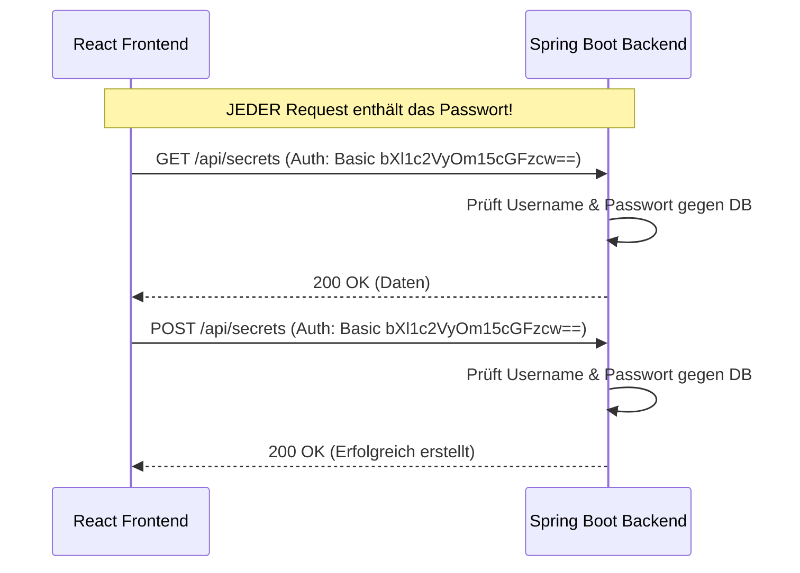
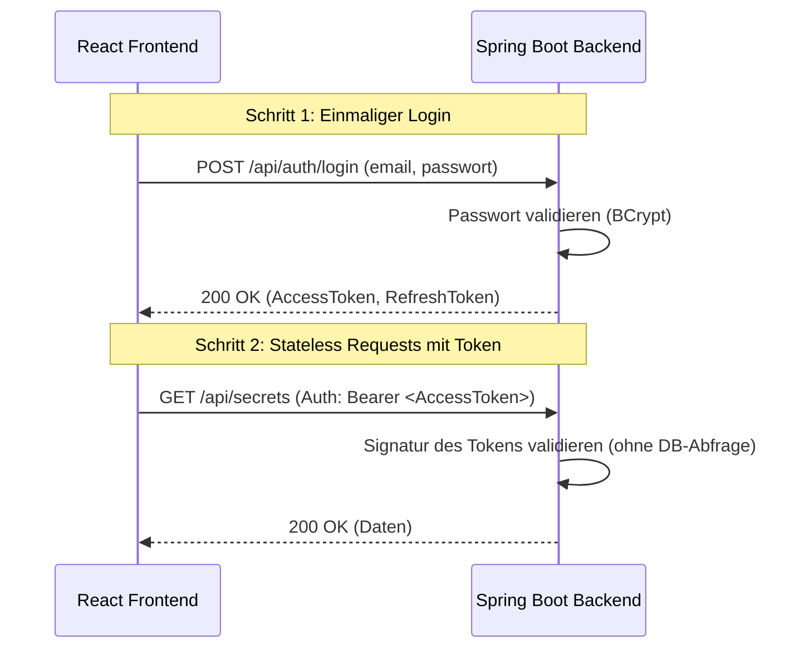

# Basic-Authentication versus JWT

Dieses Dokument erklärt den Unterschied zwischen klassischer Basic-Authentication und JWT (JSON Web Token) und stellt beide Ansätze in einem Sequenzdiagramm dar.

## 1. Basic-Authentication
Bei der Basic-Authentication müssen der Benutzername und das Passwort bei **jedem einzelnen Request** mitgeschickt werden (meist Base64-codiert). Das ist unsicher, ineffizient und skaliert schlecht.

## 2. JWT (JSON Web Token) Authentication
Hier werden die Credentials (E-Mail & Passwort) nur **ein einziges Mal** beim initialen Login gesendet. Der Server stellt einen kryptografisch signierten Ausweis (JWT) aus. Alle weiteren Anfragen verwenden nur noch dieses Token.

