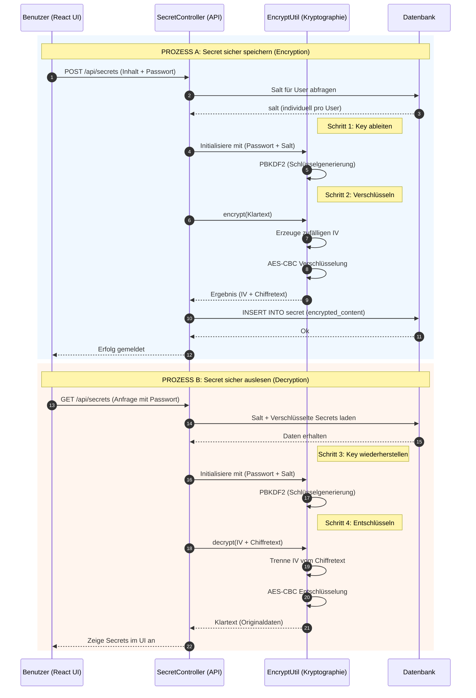

# Technische Dokumentation: Kryptographie-Implementierung (Tresor)

Diese Dokumentation dient als Nachweis für die implemntierten Sicherheitsmechanismen (AES-256 & PBKDF2) und erklärt die technischen Hintergründe für die Bewertung.

---




---

## 2. Implementierung im Code (Deep-Dive)

### 2.1 Schlüsselableitung mit PBKDF2
**Datei:** `EncryptUtil.java`

Anstatt das Passwort direkt zu nutzen, leiten wir einen kryptographisch starken Schlüssel ab. Dies verhindert, dass schwache Passwörter direkt zu schwachen AES-Keys führen.

```java
// PBKDF2 Konfiguration in EncryptUtil.java
private SecretKey deriveKey(String password, String saltBase64) throws Exception {
    byte[] salt = Base64.getDecoder().decode(saltBase64);
    // 65536 Iterationen machen Brute-Force extrem zeitaufwendig
    KeySpec spec = new PBEKeySpec(password.toCharArray(), salt, 65536, 256);
    SecretKeyFactory factory = SecretKeyFactory.getInstance("PBKDF2WithHmacSHA256");
    byte[] keyBytes = factory.generateSecret(spec).getEncoded();
    return new SecretKeySpec(keyBytes, "AES");
}
```

### 2.2 Verschlüsselung mit IV (Initialisierungsvektor)
**Datei:** `EncryptUtil.java`

Ein **IV** ist eine zufällige Zahl, die sicherstellt, dass die Verschlüsselung bei gleichem Inhalt jedes Mal ein anderes Ergebnis liefert. Ohne IV könnten Angreifer Muster (z.B. häufig vorkommende Wörter) erkennen.

```java
public String encrypt(String data) {
    // Generierung eines zufälligen 16-Byte IV
    byte[] iv = new byte[16];
    new SecureRandom().nextBytes(iv); 
    IvParameterSpec ivSpec = new IvParameterSpec(iv);

    cipher.init(Cipher.ENCRYPT_MODE, secretKey, ivSpec);
    byte[] encryptedData = cipher.doFinal(data.getBytes());

    // IV wird vorne an den Chiffretext gehängt, damit er beim 
    // Entschlüsseln wieder extrahiert werden kann.
    byte[] combined = combine(iv, encryptedData);
    return Base64.getEncoder().encodeToString(combined);
}
```

### 2.3 Integration im Controller
**Datei:** `SecretController.java`

Hier wird sichergestellt, dass jedes Secret individuell für den Benutzer verschlüsselt wird.

```java
// Auszug aus createSecret2 (SecretController.java)
User user = userService.findByEmail(newSecret.getEmail());
// Der individuelle Salt des Users wird aus der DB geladen
EncryptUtil encryptUtil = new EncryptUtil(newSecret.getEncryptPassword(), user.getSalt());

Secret secret = new Secret(
      null,
      user.getId(),
      encryptUtil.encrypt(newSecret.getContent().toString()) // Verschlüsselung
);
secretService.createSecret(secret);
```

---

## 3. Fachbegriffe & FAQ

| Begriff | Bedeutung | Warum implementiert? |
| :--- | :--- | :--- |
| **AES-256** | Symmetrischer Verschlüsselungsstandard mit 256-Bit Keys. | Aktueller Goldstandard; bietet Schutz vor modernsten Angriffen. |
| **PBKDF2** | Password-Based Key Derivation Function 2. | Erhöht die Sicherheit massiv, da Angreifer für jedes Passwort Millionen von Hashes berechnen müssten. |
| **IV** | Initialisierungsvektor (Zufallszahl). | Verhindert, dass identische Daten (z.B. dasselbe Passwort für zwei Logins) dasselbe verschlüsselte Muster erzeugen. |
| **Salt** | Eine zufällige Zeichenfolge pro Benutzer. | Sorgt für **individuelle Schlüssel**. Ohne Salt könnten Angreifer mit "Pre-computed Tables" (Rainbow Tables) Millionen von Usern gleichzeitig angreifen. |
| **Base64** | Ein Verfahren zur Kodierung von Binärdaten in Text. | Ermöglicht es, die verschlüsselten (binären) Daten sicher als Text in der Datenbank (`LONGTEXT`) zu speichern. |

---

## 4. Begründung der Umsetzung
Die gewählte Architektur erfüllt nicht nur die funktionalen Anforderungen, sondern folgt dem **Prizip der "Defense in Depth"**:
1. Wenn die Datenbank gestohlen wird, sind die Secrets nutzlos, da sie verschlüsselt sind.
2. Wenn ein Benutzer ein schwaches Passwort wählt, schützt PBKDF2 durch hohe Rechenlast.
3. Wenn ein Angreifer Muster analysiert, wird er durch den IV gestoppt.
4. Durch die individuellen Salts pro Benutzer ist jeder Account eine eigene "Festung".
