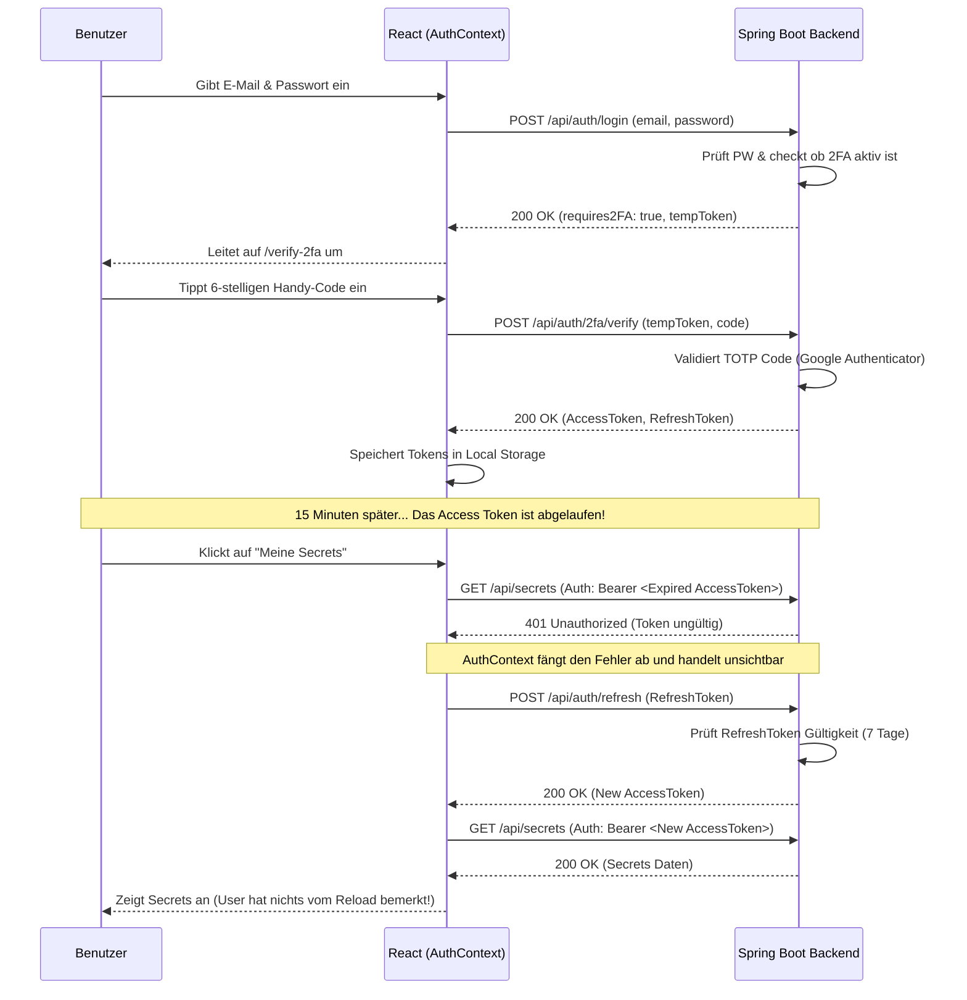

# Sequenzdiagramm: Login, 2FA und Refresh-Token

Dieses Sequenzdiagramm zeigt die Essenz unserer gesamten Authentifizierungs-Umsetzung. Es kombiniert den Login-Prozess, die Zwei-Faktor-Authentifizierung und den extrem coolen automatischen Token-Refresh im Hintergrund.



## 2. Wo findest du was im Code? (Dein Spickzettel)

Wenn dein Dozent fragt: *"Zeig mir mal im Code, wo das passiert..."*, dann schlägst du genau hier nach. Klicke auf die Links, um direkt in die Dateien zu kommen.

### 🔑 Schritt 1: Initialer Login (Passwort prüfen & 2FA Check)
*   **Frontend:** Wenn der User auf "Anmelden" klickt, wird die Datei [`LoginUser.js`](file:///Users/taafaal4/Documents/coding_schule/BBW_coding_projects/java/183/tresorfrontend/src/pages/user/LoginUser.js) aktiv. Sie ruft die zentrale Login-Funktion im [`AuthContext.js`](file:///Users/taafaal4/Documents/coding_schule/BBW_coding_projects/java/183/tresorfrontend/src/context/AuthContext.js) auf.
*   **Backend:** Die Anfrage landet in [`AuthController.java`](file:///Users/taafaal4/Documents/coding_schule/BBW_coding_projects/java/183/tresorbackend/src/main/java/ch/bbw/pr/tresorbackend/controller/AuthController.java) in der Methode `login()`.

**Zeig diesen Code-Ausschnitt im Backend (`AuthController.java`), um den 2FA-Check zu beweisen:**
```java
// Hat der User 2FA aktiviert?
if (user.isTwoFactorEnabled() && user.getTotpSecret() != null) {
    String tempToken = jwtTokenProvider.generateTempToken(user.getEmail());
    return ResponseEntity.ok(new LoginResponse(
        "2FA-Code erforderlich", user.getId(), null, null, user.getRole(), true, tempToken));
}
```

### 📱 Schritt 2: 2FA Code aus der App verifizieren
*   **Frontend:** Weil das Backend `requires2FA: true` gemeldet hat, springt das Frontend auf die Seite [`Verify2FA.js`](file:///Users/taafaal4/Documents/coding_schule/BBW_coding_projects/java/183/tresorfrontend/src/pages/user/Verify2FA.js). Der eingegebene Code geht dann wieder über [`AuthContext.js`](file:///Users/taafaal4/Documents/coding_schule/BBW_coding_projects/java/183/tresorfrontend/src/context/AuthContext.js) (`verify2FA()`).
*   **Backend:** Das landet wieder im [`AuthController.java`](file:///Users/taafaal4/Documents/coding_schule/BBW_coding_projects/java/183/tresorbackend/src/main/java/ch/bbw/pr/tresorbackend/controller/AuthController.java) bei `verify2FA()`. Dort wird der [`TotpService.java`](file:///Users/taafaal4/Documents/coding_schule/BBW_coding_projects/java/183/tresorbackend/src/main/java/ch/bbw/pr/tresorbackend/service/TotpService.java) beauftragt, zu prüfen, ob der 6-stellige Code von Google Authenticator richtig ist.

### 🛡️ Schritt 3: Der Türsteher für jeden Request (JWT Validierung)
*   **Backend:** Bei jedem weiteren Klick (z.B. "Meine Secrets" laden), schickt das Frontend das Token mit. Geprüft wird das im Backend durch den [`JwtAuthenticationFilter.java`](file:///Users/taafaal4/Documents/coding_schule/BBW_coding_projects/java/183/tresorbackend/src/main/java/ch/bbw/pr/tresorbackend/security/JwtAuthenticationFilter.java).

**Zeig diesen Ausschnitt (`JwtAuthenticationFilter.java`), um zu zeigen, dass Spring Security den Ausweis prüft:**
```java
if (token != null && jwtTokenProvider.validateToken(token)) {
    String email = jwtTokenProvider.getEmailFromToken(token);
    String role = jwtTokenProvider.getRoleFromToken(token);
    // ... Spring Security lässt den Request durch und kennt jetzt die Rolle
}
```

### ✨ Schritt 4: Der Wow-Effekt (Automatischer Token-Refresh)
*   **Frontend:** Das ist das absolute Highlight! In [`AuthContext.js`](file:///Users/taafaal4/Documents/coding_schule/BBW_coding_projects/java/183/tresorfrontend/src/context/AuthContext.js) haben wir die magische Methode `authFetch()`. Sie fängt jede API-Anfrage ab.

**Zeig diesen Ausschnitt (`AuthContext.js`), um zu beweisen, dass der Token-Refresh komplett im Hintergrund passiert, wenn der alte Token (nach 15 Min) abgelaufen ist:**
```javascript
const authFetch = useCallback(async (url, options = {}) => {
    // ... initialer Request
    let response = await fetch(url, { ...options, headers });

    // Wenn 401 kommt (Token abgelaufen), holt es sneaky ein neues und versucht es nochmal
    if (response.status === 401) {
        const newToken = await refreshAccessToken();
        const retryHeaders = {
            ...options.headers,
            Authorization: `Bearer ${newToken}`
        };
        // Den ursprünglichen Request nochmal abschicken. Der User merkt absolut nichts davon!
        response = await fetch(url, { ...options, headers: retryHeaders });
    }
    return response;
}, [...]);
```
*   **Backend:** Dieser heimliche Refresh-Aufruf landet im Backend im [`AuthController.java`](file:///Users/taafaal4/Documents/coding_schule/BBW_coding_projects/java/183/tresorbackend/src/main/java/ch/bbw/pr/tresorbackend/controller/AuthController.java) in der Methode `refreshToken()`.
