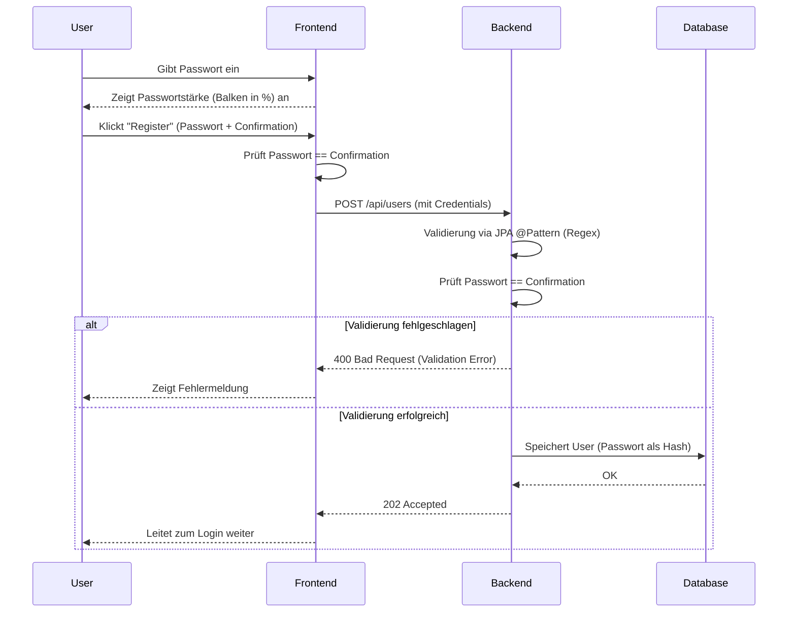
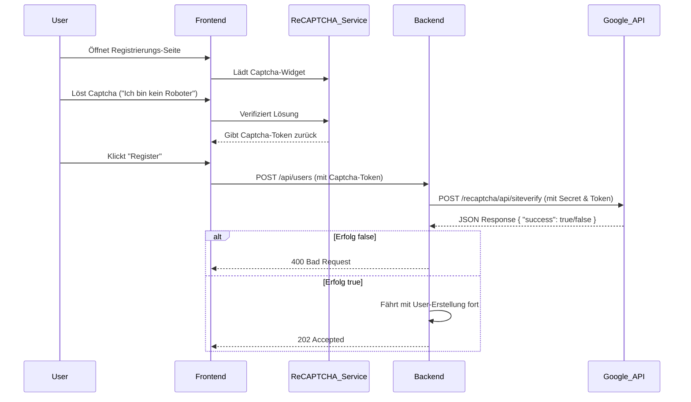

# Dokumentation: Passwortstärke, Captcha und Passwort-Reset

## 1. Passwortstärke (Password Strength)

Die Passwortstärke wird sowohl im Frontend (für unmittelbares User-Feedback) als auch im Backend (zur Gewährleistung der Sicherheit) geprüft.

### Essenz der Umsetzung
- **Frontend**: In `RegisterUser.js` und `ResetPassword.js` wird bei jeder Eingabe die Passwortstärke in Prozent berechnet (Hilfsfunktion `PasswordStrength.js`) und über einen farbigen Balken (Rot, Orange, Grün) visualisiert. Die Regel berücksichtigt Gross-/Kleinbuchstaben, Zahlen, Sonderzeichen und Länge (8-20 Zeichen).
- **Backend**: In der Entity `RegisterUser.java` (und in `ResetPasswordRequest.java`) wird das Passwort-Feld mittels `@Pattern`-Annotation und einer Regular Expression (`^(?=.*[a-z])(?=.*[A-Z])(?=.*\d)(?=.*[@#$%^&+=!]).{8,20}$`) validiert. 
- Das Backend prüft zudem aktiv, ob `password` und `passwordConfirmation` identisch sind.

### Sequenzdiagramm Passwortstärke

## 2. Captcha (ReCAPTCHA)

Um automatisierte Anmeldungen (Bots) zu verhindern, wird Google ReCAPTCHA v2 eingesetzt.

### Essenz der Umsetzung
- **Frontend**: Die Komponente `ReCAPTCHA` aus `react-google-recaptcha` wurde in `RegisterUser.js` eingebunden. Der generierte Token (`recaptchaToken`) wird in den Registrierungs-Request inkludiert.
- **Backend**: Im `UserController` wird vor der Anlage des Users der Token an die Google Siteverify-API gesendet. Nur wenn Google `success: true` zurückliefert, wird die Registrierung fortgesetzt.

### Sequenzdiagramm Captcha

## 3. Passwort Vergessen (Password Reset)

Ein vollständiger Flow zur Wiederherstellung des Passworts wurde implementiert.

### Essenz der Umsetzung
- **Datenbank**: Die `User`-Tabelle wurde um `reset_token` und `reset_token_expiry` erweitert.
- **Backend**: 
  - `POST /api/users/forgot-password`: Generiert eine UUID als Token, speichert sie mit einem Ablaufdatum (+1 Stunde) in der User-Entity und gibt einen Link mit Token (simuliert) in der Konsole aus.
  - `POST /api/users/reset-password`: Validiert den Token (Existenz und Ablaufdatum), prüft das neue Passwort (Stärke und Übereinstimmung) und überschreibt das bestehende Passwort mit einem neuen Hash. Anschliessend wird der Token gelöscht.
- **Frontend**:
  - `ForgotPassword.js`: Nimmt eine E-Mail-Adresse entgegen.
  - `ResetPassword.js`: Nimmt den Token aus der URL entgegen, lässt den User ein neues Passwort eingeben (inkl. Stärke-Prüfung) und sendet alles ans Backend.
- **Sicherheit & Spamschutz**:
  - **E-Mail Enumeration**: Beim Request eines neuen Passworts wird vom Backend unabhängig vom Existieren der E-Mail die gleiche Meldung zurückgegeben, um E-Mail-Enumeration zu verhindern.
  - **Massives Senden blockiert**: Um Spam zu verhindern, prüft das Backend bei der Anfrage eines neuen Tokens, ob in den letzten 5 Minuten bereits ein Token für diesen User generiert wurde. Ist dies der Fall, wird die Anfrage stumm ignoriert ("Spam Protection").
  - **Abgelaufene Token gelöscht**: Wenn ein User versucht, ein abgelaufenes Token (> 1 Stunde) einzulösen, wird das Token nicht nur abgelehnt, sondern aktiv aus der Datenbank gelöscht (`user.setResetToken(null)`), um Datenmüll zu verhindern.

### Problematik alte verschlüsselte Secrets
**Problem:** Da die App die Passwörter (bzw. Hashes) als Schlüssel zur Entschlüsselung der Secrets der User verwendet, gehen bei einem Passwort-Reset die alten Verschlüsselungs-Schlüssel unweigerlich verloren. Die alten Daten im Tresor können mit dem neuen Passwort nicht mehr entschlüsselt werden und würden als kryptischer Datenmüll im UI angezeigt werden oder zu Fehlern führen.
**Lösung:** In der Methode `changeUserPassword` (in `PasswordResetService.java`) wird dieser Umstand explizit gelöst, indem vor dem Speichern des neuen Passworts **alle bisherigen Secrets des Users gelöscht werden** (`secretRepository.delete(...)`). Der User fängt mit seinem neuen Passwort auch mit einem leeren (aber fehlerfreien) Tresor an.

## 4. Hervorragendes / Wow-Effekt
Um die Anforderungen an die Sicherheit massiv zu übertreffen, wurden im Frontend zwei **Industrie Best-Practices** implementiert, die in professionellen Web-Apps heutzutage zum Standard gehören sollten:

1. **"Have I Been Pwned" (HIBP) Integration:** Wenn der User ein Passwort eingibt, prüft das Frontend sofort im Hintergrund, ob dieses Passwort in einem bekannten Daten-Leak (Data Breach) aufgetaucht ist. Dazu wird das Passwort sicher als SHA-1 Hash lokal berechnet und nur die ersten 5 Zeichen des Hashes (k-Anonymität) an die HIBP-API gesendet. Falls das Passwort geleakt wurde, erscheint eine auffällige rote Warnung (z. B. *"Dieses Passwort wurde bereits 14'502 Mal in Daten-Leaks gefunden. Bitte wähle ein anderes!"*).
2. **Sicheres Passwort generieren:** Neben dem Passwort-Feld befindet sich nun ein Button, der dem User auf Knopfdruck ein extrem sicheres (16 Zeichen lang, inkl. Sonderzeichen, Zahlen, Groß-/Kleinschreibung) und kryptografisch zufälliges Passwort (`crypto.getRandomValues`) generiert und direkt in beide Felder (Passwort & Bestätigung) einfüllt. Das entlastet den User stark und erhöht die Gesamtsicherheit der App.

