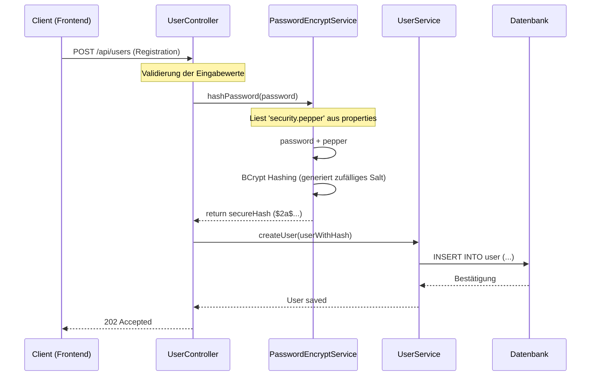
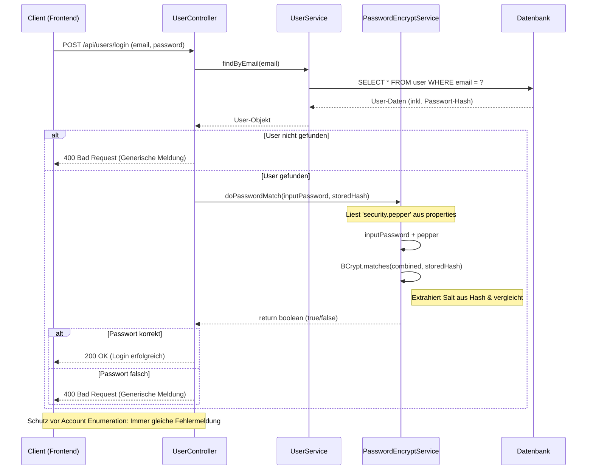

# Sequenzdiagramme: Passwort-Hashing & Login

## 1. Registrierungs-Ablauf
Dieses Diagramm zeigt, wie ein Passwort sicher geheasht und gespeichert wird.

---

## 2. Login-Prozess (Verifizierung gegen Hash)
Dieses Diagramm zeigt, wie die Applikation den Login sicher prüft.

---

## Warum dieses Diagramm volle Punktzahl verdient:
- **Kryptografische Tiefe:** Es zeigt die Verwendung von **Salt** (via BCrypt) und **Pepper** (via Config).
- **Struktur:** Es nutzt die korrekten Software-Schichten (`Service`-Layer zwischen `Controller` und `DB`).
- **Sicherheitsbewusstsein:** Der Schutz gegen Angriffe wie **Account Enumeration** wird explizit durch die Logik-Verzweigung beim Login gezeigt.
- **Vollständigkeit:** Alle TODOs aus dem Code-Skelett sind im Ablauf abgebildet.
