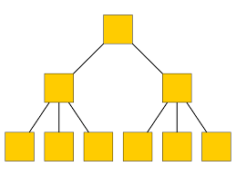
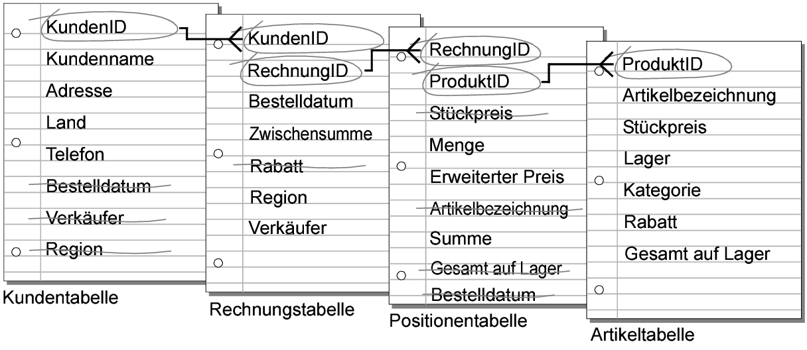
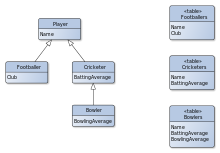
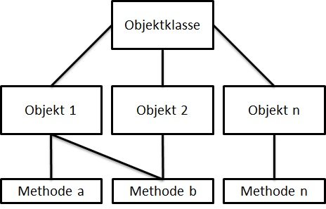

# Block 1: Repetition und Einführung in MariaDB

## Aufgabe 1.1: Datenbankmodelle und Datenbanktheorie

### Datenbankmodelle

#### Hierarchische Datenbank

- Älteste Datenbankmodell
- Bildet die reale Welt durch eine hierarchische Baumstruktur ab.

#### Relationale und Objektrelationale Datenbanken

##### Relationale Datenbank

- Form von Tabellen
- Relationenmodell beschreibt welche Tabellen angelegt werden müssen, wie diese aufgebaut sind und wie sie miteinander verbunden sind.

#####  Objektrelationale Datenbank

- Es ist eine Datenbank, in welcher Datensätze als Objekte gespeichert werden, wodurch komplexe Datenstrukturen übersichtlich abgebildet werden können.

#### Objektorientierte Datenbanken

- Es ist ein Datenbankmodell, das auf dem objektorientierten Modell basiert.
- Ein Datensatz wird mit all seinen Attributen zu einem Objekt zusammengefasst.

# 

### Datenbanktheorie
#### Aufgaben und Eigenschaften von relationalen Datenbanken
- Eigenschaften
    - Jede Tabelle repräsentiert eine Entität (z. B. Kunden, Produkte).
    - Beziehungen zwischen Entitäten werden durch Fremdschlüssel hergestellt.
    - Relationale Datenbanken unterstützen Transaktionen und gewährleisten Konsistenz, Isolation, Dauerhaftigkeit und Atomarität.
- Aufgaben 
    - Daten speichern und organisieren
    - Datenintegrität gewährleisten
    - Transaktionen verwalten
    - Sicherheit und Zugriffssteuerung
    - Skalierbarkeit und Performance
    - Backup und Wiederherstellung

# 

### Datenbanksprache SQL

#### Data Definition Language (DDL)
- Dient zur Definition des Datenbankschemas.
- Befehle
    - `CREATE TABLE`: Erzeugt eine neue Tabelle.
    - `ALTER TABLE`: Ändert die Struktur einer vorhandenen Tabelle (z. B. Hinzufügen oder Löschen von Spalten).
    - `DROP TABLE`: Löscht eine Tabelle.
    - `Remname Table`: Nennt die Tabelle um.

#### Data Manipulation Language (DML)
- Ermöglicht die Datenmanipulation (Ändern, Einfügen, Löschen von Datensätzen).
- Befehle
    - `INSERT`: Fügt neue Datensätze in eine Tabelle ein.
    - `UPDATE`: Aktualisiert vorhandene Datensätze.
    - `DELETE`: Löscht Datensätze.
    - `SELECT`: Extrahiert Daten aus einer Tabelle.

#### Data Retrieval Language (DRL)

- dient zur Abfrage und Aufbereitung von Daten.
- Befehle
    - `SELECT`: Wird verwendet, um Daten aus einer oder mehreren Tabellen abzurufen.

#### Data Control Language (DCL)

- Verwaltet die Rechteverwaltung
- Befehle
    - `GRANT`: Gewährt Berechtigungen an Benutzer.
    - `REVOKE`: Entzieht Berechtigungen.
#### Transaction Control Language (TCL)
- Steuert Transaktionen
- Befehle
    - `COMMIT`: Bestätigt eine Transaktion.
    - `ROLLBACK`: Macht eine Transaktion rückgängig.

## Aufgabe 1.2: Repetitionsfragen

1. Was ist eine Relationale Datenbank?
Die relationale Datenbank ist eine Sammlung von Tabellendateien, mit denen Unternehmen Daten organisieren, verwalten und verknüpfen von Daten können.

2. Nennen Sie drei verschiedene relationale Datenbank Management Systeme DBMS
- MySQL
- Oracle Database
- Microsoft SQL Serve

3. Welche Aufgaben erfüllt ein DBMS für Sie als Entwickler?
- Es erleichtert den gleichzeitigen Zugriff auf eine Datenbank von mehreren Benutzern oder Anwendungen.
- Es legt Sicherheitsregeln und Zugriffsrechte für die Daten fest und überwacht sie.
- Es führt regelmäßige Datensicherungen durch und stellt die Daten im Falle eines Ausfalls schnell wieder her.
- Es richtet Datenbankregeln und -standards ein, um die Datenintegrität zu schützen.
- Es optimiert die Leistung und Effizienz der Datenbank durch verschiedene Techniken wie Indizierung, Caching oder Partitionierung.

4. Wie greifen Benutzer (keine Entwickler) auf eine Datenbank zu?
Benutzer (keine Entwickler) können auf eine Datenbank zugreifen, indem sie eine Anwendung verwenden, die mit dem Datenbankmanagementsystem (DBMS) verbunden ist. 

5. Handelt es sich bei SQL um eine Programmiersprache?
SQL ist keine allgemeine Programmiersprache

6. Ist die Sprache SQL auf allen Datenbanken gleich?
Nein, SQL ist eine normierte Sprache für relationale Datenbanken, aber es gibt verschiedene Dialekte oder Versionen von SQL.

7. Was versteht man unter NoSQL Datenbank?
Unter NoSQL-Datenbanken versteht man eine Kategorie von Datenbanken, die im Gegensatz zu traditionellen relationalen Datenbanken nicht auf dem SQL-Tabellenschema basieren. NoSQL-Datenbanken sind flexibler und ermöglichen die Speicherung und Verarbeitung unstrukturierter Daten.

8. Nennen Sie drei NoSQL Datenbanksysteme?

- MongoDB
- Cassandra
- Redis

9. Was versteht man unter Datenbank Schema?
Ein Datenbank-Schema definiert die Struktur der Datenbank, einschließlich der Tabellen, Felder, Beziehungen und Constraints.

10. Wozu dient ein Entity Relationship Model (ERM)?
Ein Entity Relationship Model (ERM) dient dazu, die Struktur und Beziehungen zwischen Entitäten in einer Datenbank grafisch darzustellen. Es hilft bei der Planung und Veranschaulichung des Datenbankdesigns.

11. Wie sieht ein Enhanced Entity Relationship (EER) Model aus?
Ein Enhanced Entity Relationship Model (EER) erweitert das ERM durch zusätzliche Konzepte wie Generalisierung, Spezialisierung und abgeleitete Attribute zur besseren Abbildung komplexer Beziehungen.

12. Was bedeuten die Begriffe: Entität, Attribut und Tupel?
- Entität: Ein Objekt oder Element in der Datenbank, z.B. eine Person oder ein Produkt.
- Attribut: Eine Eigenschaft oder Charakteristik einer Entität, z.B. die Farbe oder Größe eines Produkts.
- Tupel: Eine einzelne Zeile in einer Tabelle, die alle Attribute einer Entität enthält.

13. Was versteht man unter Datenkonsistenz?
Datenkonsistenz bezieht sich auf die Genauigkeit und Zuverlässigkeit der Daten in einer Datenbank. Konsistente Daten erfüllen die definierten Regeln und Integritätsbedingungen.

14. Was bedeutet Redundanz im Zusammenhang mit einer Datenbank?
Redundanz in einer Datenbank bezieht sich auf die wiederholte Speicherung derselben Daten in verschiedenen Teilen der Datenbank. Dies kann zu Inkonsistenzen und erhöhtem Speicherbedarf führen.

15. Was versteht man unter Normalform?
Die Normalform ist ein Konzept in der Datenbanknormalisierung, das sicherstellt, dass Daten effizient und konsistent gespeichert werden. Es gibt verschiedene Normalformen (1NF, 2NF, 3NF usw.), die bestimmte Anforderungen an die Datenstruktur festlegen.

16. Wie unterscheiden sich die erste, zweite und dritte Normalform?
- 1NF: Pro Spalte ein Wert.
- 2NF: Einträge in einer Tabelle müssen voll funktional von jedem Schlüssel abhängig sein.
- 3NF: Es sollte keine transitive Abhängigkeit zwischen Nicht-Schlüsselattributen geben.

17. Was versteht man unter Primär- und Fremdschlüssel?
- Primärschlüssel: Ein eindeutiges Identifikationsattribut für eine Entität in einer Tabelle.
- Fremdschlüssel: Ein Attribut in einer Tabelle, das auf den Primärschlüssel einer anderen Tabelle verweist.

18. Was ist referentielle Integrität?
Referentielle Integrität stellt sicher, dass Beziehungen zwischen Tabellen durch die Verwendung von Primär- und Fremdschlüsseln aufrechterhalten werden und dass keine ungültigen Verweise existieren.

19. Was bringt Object-Relational Mapping (ORM)?
Object-Relational Mapping (ORM) ermöglicht die Abbildung von Datenbankobjekten auf Objekte in einer Programmiersprache, was die Integration von Datenbanken in Anwendungen erleichtert.

20. Wie unterscheiden sich die Datentypen Char und Varchar?
- Char: Fixe Länge, speichert Zeichenketten mit vordefinierter Länge.
- Varchar: Variable Länge, speichert Zeichenketten mit variabler Länge.

21. Was ist ein Character Set und wie unterscheiden sich ASCII, LATIN1 und UTF-8?
Ein Character Set definiert die Menge der Zeichen, die in einer Datenbank verwendet werden können.
- ASCII: Enthält 128 Zeichen für die Codierung von Text.
- LATIN1: Ein erweitertes Zeichenset, das 256 Zeichen unterstützt.
- UTF-8: Ein Unicode-basiertes Zeichenset, das weltweit eine breite Palette von Zeichen unterstützt.

22. Wie unterscheiden sich die Datentypen Integer und Float?
- Integer: Ganzzahliger Datentyp ohne Dezimalstellen.
- Float: Gleitkommazahliger Datentyp mit Dezimalstellen für präzisere Berechnungen.

23. Wozu verwendet man den Datentyp Decimal?
Der Datentyp Decimal wird verwendet, um Gleitkommazahlen mit fester Genauigkeit und Dezimalstellen zu speichern, um Rundungsfehler zu minimieren.

24. Wie unterscheiden sich die Datentypen Timestamp und Datetime?
- Timestamp: Speichert einen Zeitstempel, oft mit hoher Präzision.
- Datetime: Speichert Datum und Uhrzeit ohne zusätzliche Präzision.

25. Wie unterscheiden sich 0 und NULL?
- 0: Eine numerische Null.
- NULL: Ein spezieller Marker in Datenbanken, der auf das Fehlen von Daten oder den unbekannten Wert hinweist.

