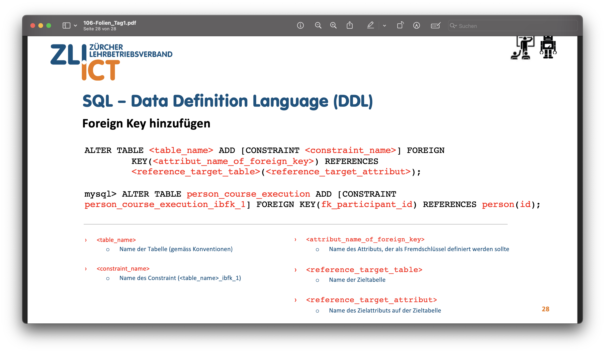
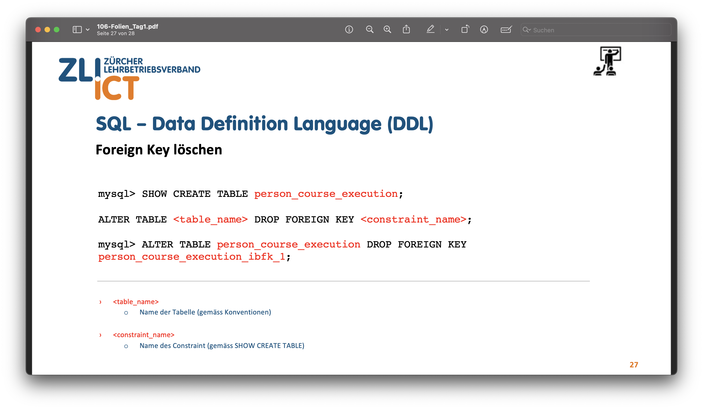
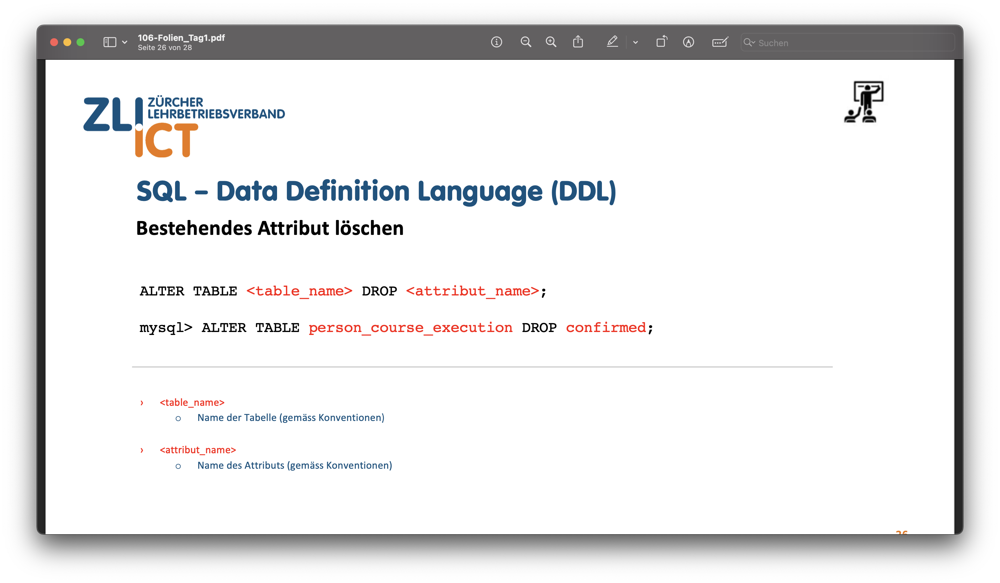
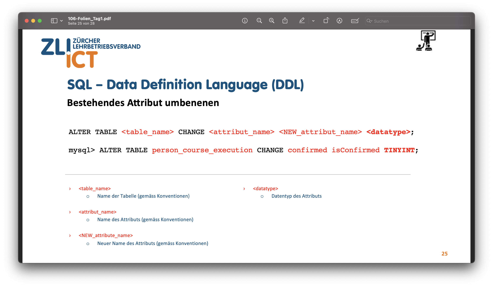
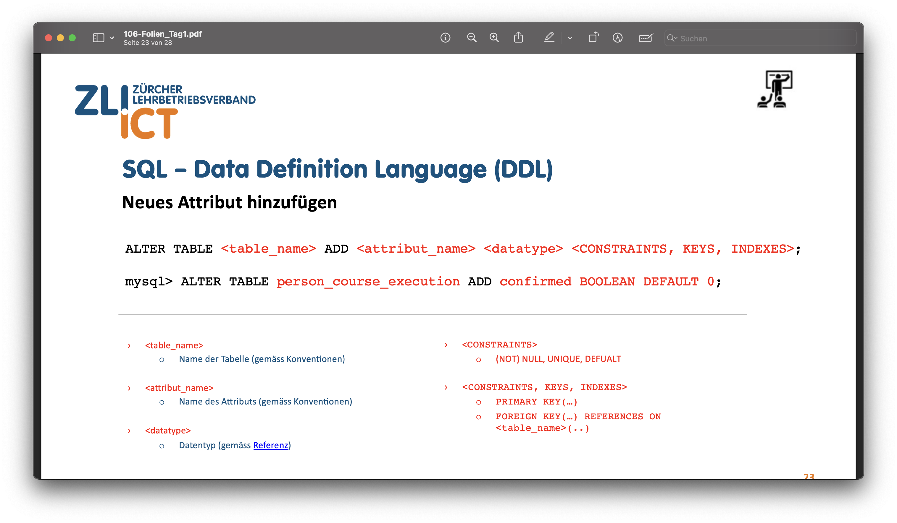
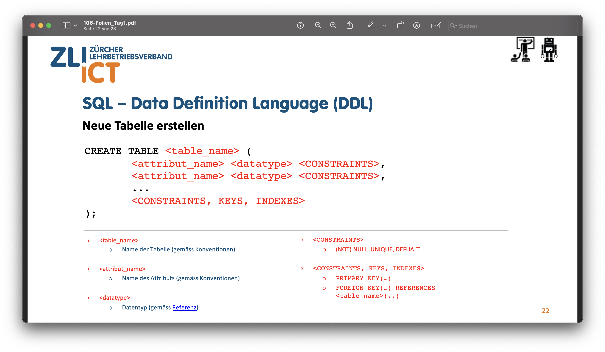
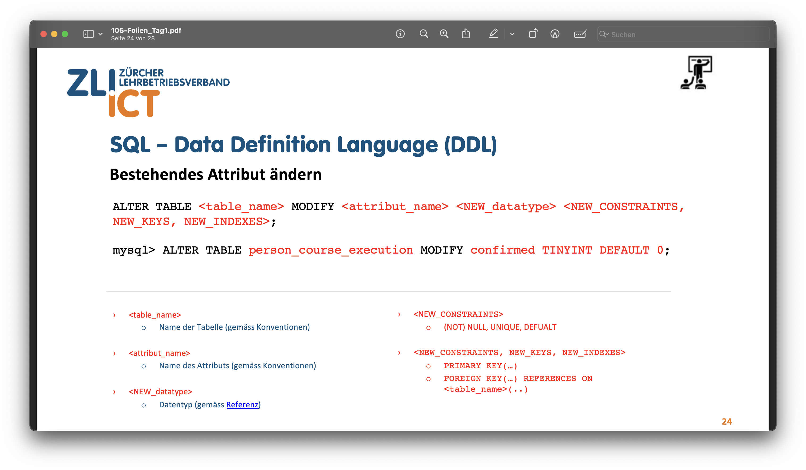

# LBa (15’’, 25%) – praktisch, schriftlich

## Prüfungsinhalt
- Data Definition Language (DDL)

## SQL – generelle Befehle
1. › C:/> mysql.exe -u root -p localhost
    - Verbindung mit dem User (-u) root und mit Abfragen von Passwort (-p)
zum Datenbank-Server, welcher auf localhost läuft.
2. › mysql> \?
    - Hilfe anzeigen
3. mysql> SHOW DATABASES; 
    - Listet alle Datenbanken auf dem Datenbank-Sever

4. mysql> USE mysql;
    - Verbindet zur Datenbank mysql auf dem Datenbank-Server (localhost)

5. mysql> SHOW TABLES;
    - Liste alle Tabellen auf der Verbundenen Datenbank (mysql)

6. mysql> DESCRIBE user; 

mysql> DESC user;
    - Listet alle Felder der Tabelle user in der Datenbank mysql
    - zeigt attribute an.


## SQL – Sprachelemente

1. DATA DEFINITION LANGUAGE (DDL)
2. DATA MANIPULATION LANGUAGE (DML)
3. DATA RETRIEVAL LANGUAGE (DRL)
4. TRANSACTION CONTROL LANGUAGE (TCL)
5. DATA CONTROL LANGUAGE (DCL)

### Prüfungsrelevante sprache DDL
- CREATE 
    -  Dieser Befehl wird verwendet, um eine neue Tabelle in SQL zu erstellen.
    - Beispiel
    ````
    CREATE TABLE `NAME` (
        category_id INT AUTO_INCREMENT,
        `NAME` VARCHAR(255) NOT NULL,
        `NAME` VARCHAR(255),
        PRIMARY KEY (category_id)
    );
- ALTER 
    - Dieser Befehl wird verwendet, um Spalten in einer vorhandenen Tabelle hinzuzufügen, zu löschen oder zu ändern. 
    - Beispiel
    `````
    ALTER TABLE Student_info ADD CGPA number;
- RENAME 
    - Wechselt den Namen der Tabelle
    - Beispiel
    ````
    RENAME TABLE Employee TO Angestellter;
- DROP
    - Dieser Befehl wird verwendet, um eine vorhandene Tabelle zusammen mit ihrer Struktur aus der Datenbank zu entfernen. 
    - Beispiel
    `````
    DROP TABLE Student_info;
## SQL-Datentypen

- INTEGER (INT)
    - Dieser Datentyp repräsentiert ganze Zahlen. 
- VARCHAR
    - Der VARCHAR-Datentyp steht für “variable character” und wird für Zeichenketten mit variabler Länge verwendet. 
- CHAR 
    - CHAR steht für “character” und repräsentiert Zeichenketten mit fester Länge. 
- BOOLEAN
    - Ein Datentyp, der entweder wahr (true) oder falsch (false) ist. 
- DATE und TIME
    - DATE speichert nur das Datum, während TIME nur die Uhrzeit speichert.
- TEXT
    - Der TEXT-Datentyp wird verwendet, um lange Zeichenketten zu speichern. 
- DECIMAL
    - Der DECIMAL-Datentyp wird für genaue Dezimalzahlen verwendet.
- ENUM 
    - ENUM ist ein Datentyp, der eine feste Liste von Werten akzeptiert. Sie können aus einer begrenzten Anzahl von Optionen wählen. Zum Beispiel: `ENUM('Rot', 'Blau', 'Grün')`.
- MEDIUMINT
    -  repräsentiert eine ganze Zahl mit mittlerer Größe. Er verwendet 3 Bytes.
    
### Extra SQL – Data Definition Language (DDL) 










